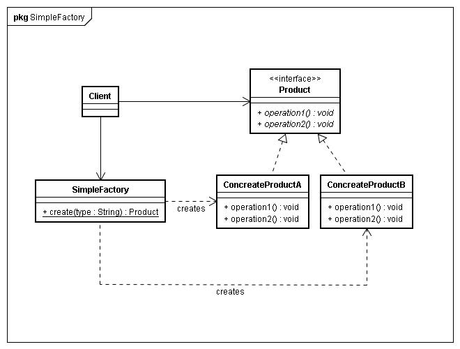
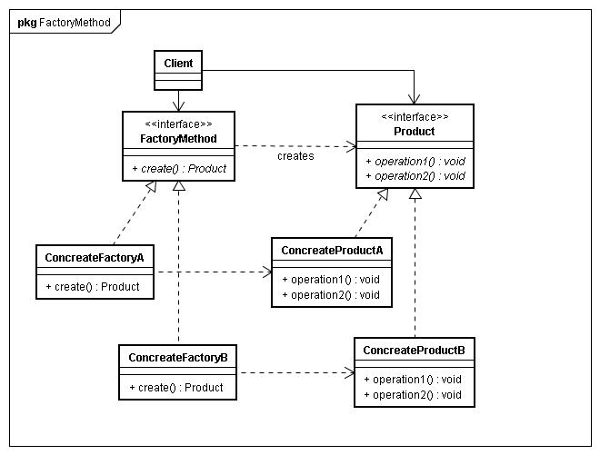

# Design-Mode
php设计模式学习

设计模式主要分为三类：
    创建型，结构型，行为型

一、创建型：
<ol>
    <li>工厂模式</li>
        
将对象的创建交给工厂来实现

        <ul>
            <li>普通工厂</li>
                
                
一般采用静态方法，给方法传递不同的参数生成不同的对象

                
缺点在于：新增一个产品类的时候需要修改工厂方法

            <li>工厂方法</li>
                
                
与普通工厂不同的是为每一个产品创建了一个工厂，每个产品都对应这一个产品工厂

            <li>抽象工厂模式</li>
                
                
为创建一组相关或相互依赖的对象提供一个接口，而且无需指定它们的具体类。

                
确定无法创建，新的产品类

        </ul>
    <li>单例模式</li>
        
一个类至始至终都只产生一个实例化对象

    <li>原型模式</li>
    <li>建造者模式</li>
    <li>工厂方法</li>
</ol>
二、结构型
    <ol>
        <li>适配器模式</li>
        <li>桥接模式</li>
        <li>装饰模式</li>
        <li>代理模式</li>
        <li>组合模式</li>
    </ol>

